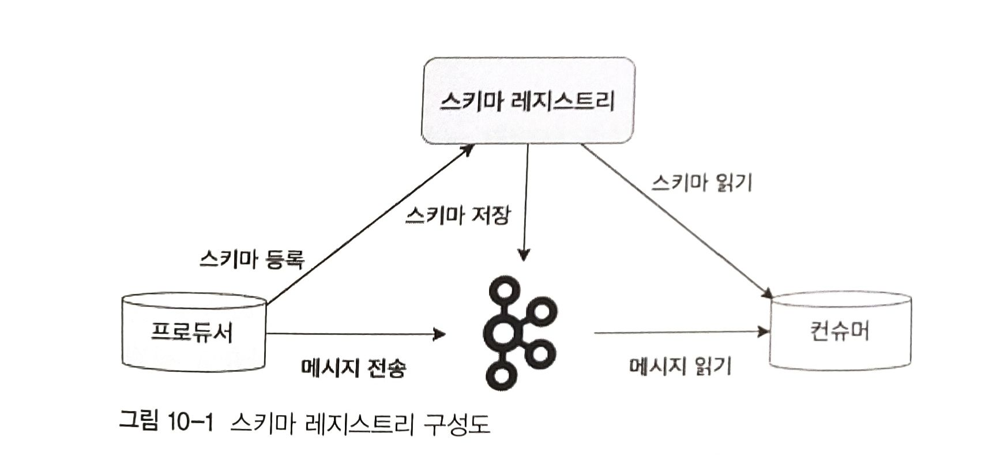
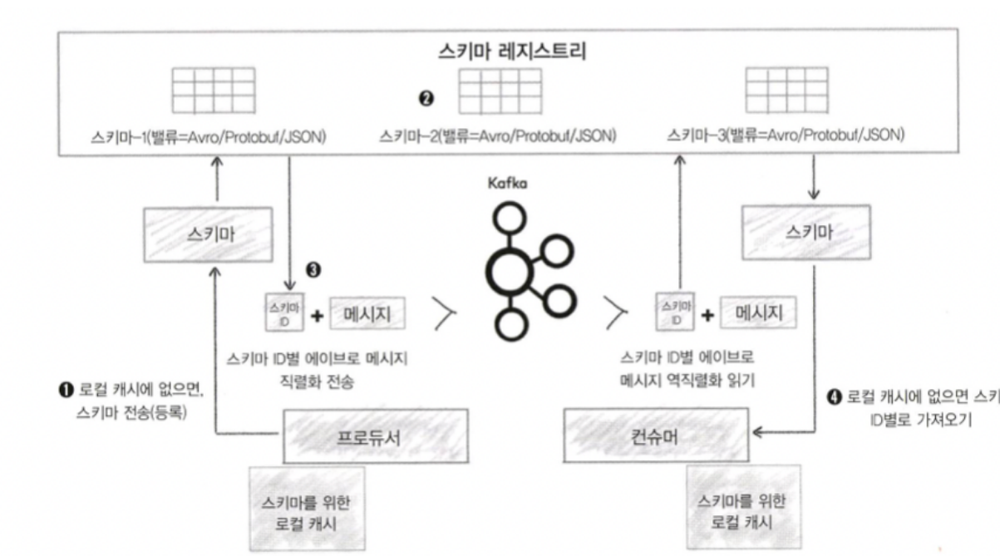
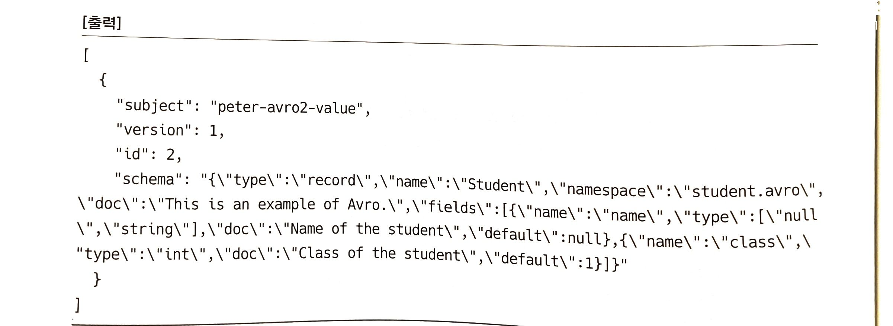
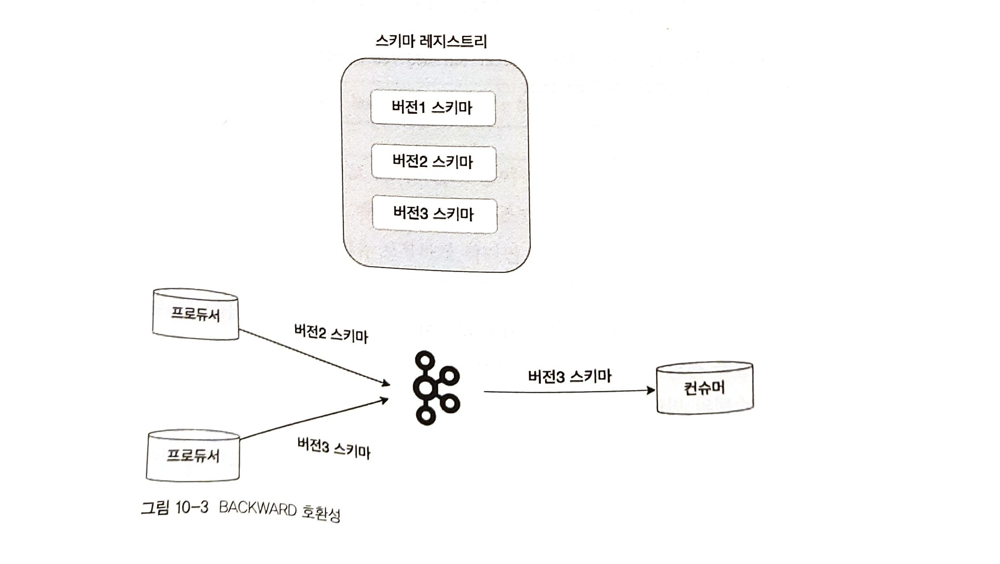
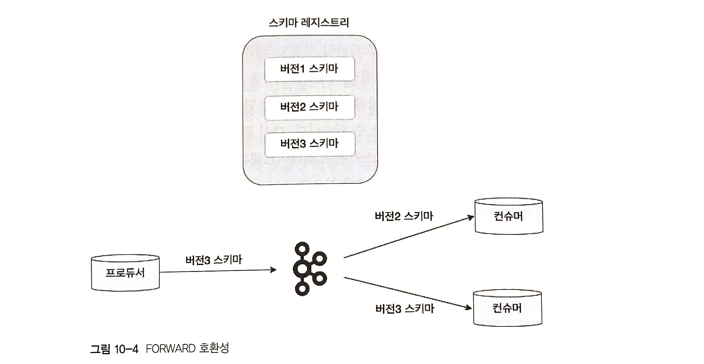

# Ch10. 스키마 레지스트리

- **스키마**: 정보를 구성하고 해석하는 것을 도와주는 프레임워크나 개념
  - 정보를 손쉽게 이해하고 해석하는데 쓰임
  - 데이터베이스의 구조 정의
  - 표현 방법, 명세, 제약 조건등을 기술하는 표준 언어로 활용
  - 카프카에서도 토픽으로 전송되는 메시지에 대해 미리 스키마를 정의한 후 전송

<br/>

***

## 10.1 스키마의 개념과 유용성
- 관계형 데이터베이스에서의 스키마
  - 미리 정의된 스키마
  - 데이터 추가시엔 반드시 미리 정의된 스카미의 형태로 데이터 입력해야함
  - 사전 정의와 다른 내용 추가시 작업은 실패함
  - 관계형 데이터베이스에 스키마가 없다면?
  - 카프카에 스키마가 없다면?

- 카프카의 구조상 데이터를 전송하는 프로듀서를 일방적으로 신뢰할수 밖에 없고, 그 프로듀서 관리자는 다수의 컨슈머에게 producing하는 데이터의 구조를 상세히 설명해줘야 함. 그러나 매번 일일히 설명하기 쉽지가 않음, 컨슈머들이 바뀔수도 있으니.<br>
-> ***데이터를 컨슘하는 여러 컨슈머들에게 해당 데이터에 대한 정확한 정의와 의미를 알려주는 역할을 하는것이 스키마***

- 스키마 사용시의 장점
  - 데이터 처리시 유연성 확보
  - 불필요한 커뮤니케이션 비용 감소

<br/>

***

## 10.2 카프카와 스키마 레지스트리
- 스키마 레지스트리에 가장 최적화된 **에이브로(Avro)**

### 10.2.1 스키마 레지스트리 개요
- 카프카에선 스키마를 활용하기 위해선 **스키마 레지스트리** 라는 별도의 애플리케이션을 사용하여야 함
  - 스키마 레지스트리: 스키마를 등록하고 관리하는 애플리케이션
  - 카프카와 별도로 구성된 독립적 애플리케이션
  - 프로듀서, 컨슈머와 직접 통신함





    - 클라이언트들이 스키마 정보를 사용하기 위해선:
    1. 프로듀서가 스키마 레지스트리에 스키마를 등록
    2. 스키마 레지스트리가 등록된 스키마 정보를 카프카의 내부 토픽에 저장
    3. 프로듀서가 스키마 레지스트리에 등록된 스키마의 ID와 메시지를 카프카에 전송
    4. 컨슈머는 스키마 레지스트리로부터 스키마 ID를 읽어온 후 프로듀서가 전송한 스키마 ID와 메시지를 조합해 읽기 가능

## 10.2.2 스키마 레지스트리의 에이브로 지원
- **에이브로(Avro)**: 스키마 레지스트리가 지원하는 **데이터 포맷** 중 가장 대표적인 포맷
  - 여러 프레임워크 사이에서 데이터 교환을 도와주는 **오픈소스 직렬화 시스템**
  - 빠른 **바이너리** 데이터 포맷 지원
  - JSON 형태의 스키마를 정의할 수 있는 매우 간결한 데이터 포맷
  - **JSON과 매핑되며 JSON보다 전송 효율이 좋고 바이너리 형태라 속도도 빠름**

```json
{"namesapce": "student.avro",
 "type": "record",
 "doc": "This is an example of Avro.",
 "name": "Student",
 "fields": [
     {"name": "name", "type": "string", "doc": "Name of the student"},
     {"name": "class", "type": "int", "doc": "Class of the student"}
 ]
 }
```
    1. namespace: 이름을 식별하는 문자열
    2. type: 에이브로는 record, enums, arrays, maps 등을 지원, 여기선 record 타입으로 정의
    3. doc: 사용자들에게 이 스키마 정의에 대한 설명
    4. name: 레코드의 이름을 나타내는 문자열, 필숫값
    5. fields: JSON 배열, 필드들의 리스트
    6. name: 필드의 이름, type: boolean, int, long, string 등의 데이터 타입 정의, doc: 사용자들에게 해당 필드의 의미 설명

- JSON 과의 차이점
  - 데이터 필드마다 데이터 타입 정의 가능
  - doc 을 이용해 각 필드의 의미를 설명 가능, 별도의 데이터 필드 정의 문서가 필요 없음

## 10.2.3 스키마 레지스트리 설치
- 최신 버전의 스키마 레지스트리 파일 다운
- 운영환경에선 카프카와 분리된 별도의 서버에서 스키마 레지스트리를 실행하는것이 일반적
- 여기선 서버 최소화를 위해 카프카가 설치된 peter-kafka03 서버에 스키마 레지스트리를 설치하고 실습진행
- wget, tar 명령어를 이용해 파일을 다운로드하고 압축 해제한 후 심볼릭 링크 설정하기
  
```linux
sudo wget http://packages.confluent.io/archive/6.1/confluent-community-6.1.0.tar.gz -O /opt/confluent-community-6.1.0.tar.gz

sudo tar zxf /opt/confluent-community-6.1.0.tar.gz -C /usr/local/

sudo ln -s /usr/local/confluent-6.1.0 /usr/local/confluent
```

- 스키마 레지스트리 설정하기 (/usr/local/confluent/etc/schema-registry/schema-registry.properties 파일을 열어 설정내역 입력)
  
```linux
vi /usr/local/confluent/etc/schema-registry/schema-registry.properties
```

```yaml
listeners=http://0.0.0.0:8081    # 1
kafkastore.bootstrap.servers=PLAINTEXT://peter-kafka01.foo.bar:9092, peter-kafka02.foo.bar:9092, peter-kafka03.foo.bar:9092    # 2
kafkastore.topic=_schemas    # 3
schema.compatibility.level=full    # 4
```

    1. listeners: 스키마 레지스트리에서 사용할 TCP 포트를 8081 포트로 지정
    2. kafkastore.bootstrap.servers: 스키마의 버전 히스토리 및 관련 데이터를 저장할 카프카 주소를 입력
    3. kafkastore.topic: 스키마의 버전 히스토리 및 관련 데이터 저장 토픽의 이름을 _schemas로 지정
    4. schema.compatibility.level: 스키마 호환성 레벨을 full 로 설정

- 중요포인트
  - 3번에서, 스키마 레지스트리에서 **스키마 저장과 관리 목적**으로 **카프카의 토픽**을 사용한다는 점
  - 4번에서, **스키마 호환성 레벨**: **BACKWARD, FORWARD, FULL** 3종류 존재, 자세한 사항은 호환성 실습부분에서!

- 브로커의 _schemas 토픽이 스키마 레지스트리의 저장소로 사용됨
  - 모든 스키마의 제목, 버전, ID 등이 저장됨
  - 스키마 관리 목적으로 사용되는 메시지들은 순서(ordering)이 중요하기 때문에 _schemas 토픽의 파티션 수는 항상 1 임

- 실습과정에선 스키마 레지스트리를 단일 모드로 구성하였지만, **운영 환경에서는 마스터/슬레이브 구조의 이중화 구성을 추천함
  - 로드밸런서를 이용해 2개의 스키마 레지스트리를 바인딩
  - 레지스트리 읽기는 마스터와 슬레이브 양쪽 모두 허용, 쓰기는 마스터 노드만 가능

<br>

- reload와 start 명령어로 스키마 레지스트리를 실행
```linux
sudo systemctl daemo-reload
sudo systemctl start schema-registry
```

- schema-registry 파일을 열어 예제코드 입력 후 실행
```linux
sudo vi /etc/systemd/system/schema/registry.service
```
```yaml
[Unit]
Description=schema registry
After=network.target

[Service]
Type=simple
ExecStart=/usr/local/confluent/bin/schema-registry-start /usr/local/confluent/etc/schema-registry/schema-registry.properties
Restart=always

[Install]
WantedBy=multi-user.target
```

<br>

- 스키마 레지스트리가 제공하는 API를 통한 스키마 레지스트리 설정 정보 불러오기
```linux
curl -X GET http://peter-kafka03.foo.bar:8081/config

[출력]
{"compatibilityLevel":"Full"}
```
    - API 응답을 통해 호환성 레벨이 FULL로 출력되는것 확인가능

<br>

- 스키마 레지스트리 API lists
```txt
GET /schemas : 전체 스키마리스트 조회
GET /schemas/ids/id : 스키마 아이디로 조회
GET /schemas/lds/id//versions : 스키마 id 버전
GET /subjects : subject리스트
GET /subjects/서브젝트이름/versions : 특정 서브젝트 버전 리스트조회
GET /config : 전역으로설정된 호환성 레벨 조회
GET /config/서브젝트이름 : 서브젝트에 설정된 호환성 조회
DELETE/subjects/서브젝트이름 :특정 서브젝트 전체삭제
DELETE/subjects/서브젝트이름/versions/버전 : 특정서브젝트에서 특정 버전만 삭제
```

***
<br/>

## 10.3 스키마 레지스트리 실습

### 10.3.1 스키마 레지스트리와 클라이언트 동작

- 스키마 레지스트리와 클라이언트 동작
  - **프로듀서가 정의한 스키마 정보를 컨슈머가 알아오는 과정**




    1. "에이브로 프로듀서"는 컨플루언트에서 제공하는 새로운 직렬화를 사용해 스키마 레지스트리의 스키마가 유효한지 여부를 확인합니다. 
        만약 스키마가 확인되지 않으면, 에이브로 프로듀서는 스키마를 등록하고 캐시함
    2. "스키마 레지스트리"는 현 스키마가 저장소에 저장된 스키마에서 업데이트됐는지 확인 후 전체 스키마에 고유 id 할당
    3. 프로듀서가 스키마 레지스트리로 부터 받은 스키마 id를 참고해서 메시지를 카프카로 전송. 
        이때 "스키마 전체내용이 아닌 메시지와 스키마 id만 보냄"
    4. "에이브로 컨슈머"는 스키마id 로 새로운 역직렬화를 사용해서 카프카의 토픽에 저장된 메시지를 읽어옴. 
        컨슈머가 스키마 id 를 가지고 있지 않다면 스키마 레지스트리로 부터 가져옴


### 10.3.2 파이썬을 이용한 스키마 레지스트리 활용
- 파이썬을 이용하여 에이브로 메시지 전송 실습 진행
- avro-producer.py 와 avro-consumer.py 작성 
- avro-producer.py 와 avro-consumer.py 둘에서 모두 스키마를 정의하고 전송할/컨슘할 벨류 스키마를 로드함
- avroProducer, avroConsumer 속성을 정의함
- value를 전송하고 전송받기

- 스키마 레지스트리의 API를 이용해 스키마가 스키마 레지스트리에 잘 기록되었는지도 확인
```linux
curl http://peter-kafka03.foo.bar:8081/schemas | python -m json.tool
```



- 스키마 레지스트리에 스키마가 잘 생성되었음
- 그러나, 스키마의 진화가 필요한 경우에는?
  - 기존 스키마의 name 필드를 first_name 과 last_name 이라는 2개의 필드로 수정

---

### Python-Avro-Produce
- python-avro-produce.py
```python
# avro 관련 모듈 임포트
from confluent_kafka import avro
from confluent_kafka.avro import AvroProducer

# schema 정의 (기존 스키마)
value_schema_str = 
"""
{"namespace": "student.avro",
 "type": "record",
 "doc": "This is an example of Avro.",
 "name": "Student",
 "fields": [
     {"name": "name", "type": "string", "doc": "Name of the student"},
     {"name": "class", "type": "int", "doc": "Class of the student"}
 ]
 }
"""

# schema 정의 (바뀐 스키마)
value_schema_str = 
"""
{"namespace": "student.avro",
 "type": "record",
 "doc": "This is an example of Avro.",
 "name": "Student",
 "fields": [
     {"name": "first_name", "type": ["null", "string"], "default": null, "doc": "First name of the student"},
     {"name": "last_name", "type": ["null", "string"], "default": null, "doc": "Last name of the student"},
     {"name": "class", "type": "int", "default": 1, "doc": "Class of the student"}
 ]
}
"""

# 밸류 스키마 로드 (기존)
value_schema = avro.loads(value_schema_str)
value = {"name": "Peter", "Class":1} # 전송할 메시지

# 밸류 스키마 로드 (변경 후)
value_schema = avro.loads(value_schema_str)
value = {"first_name": "Peter", "last_name": "Parker", "class": 1} # 바뀐 전송할 메시지

# 전송 결과 확인 함수
def delivery_report(err, msg):
    """ Called once for each message produced to indicate delivery result.
        Triggered by poll() or flush(). """
    if err is not None:
        print('Message delivery failed: {}'.format(err))
    else:
        print('Message delivered to {} [{}]'.format(msg.topic(), msg.partition()))

# AvroProducer 속성 정의
avroProducer = AvroProducer({
    'bootstrap.servers': 'peter-kafka01.foo.bar, peter-kafka02.foo.bar, peter-kafka03.foo.bar',
    'on_delivery': delivery_report,
    'schema.registry.url': 'http://peter-kafka03.foo.bar:8081'
    }, default_value_schema=value_schema)

# 메시지 전송
avroProducer.produce(topic='peter-avro2', value=value)
avroProducer.flush()

```

---

### Python-Avro-Consumer
- python-avro-consumer.py
```python
# avro 관련 모듈 임포트
from confluent_kafka import avro
from confluent_kafka.avro import AvroConsumer
from confluent_kafka.avro.serializer import SerializerError

# 스키마 정의 (기존)
value_schema_str = """
{"namespace": "student.avro",
 "type": "record",
 "doc": "This is an example of Avro.",
 "name": "Student",
 "fields": [
     {"name": "name", "type": ["null", "string"], "default": null, "doc": "Name of the student"},
     {"name": "class", "type": "int", "default": 1, "doc": "Class of the student"}
 ]
}
"""

# 스키마 정의 (변경 후)
value_schema_str = """
{"namespace": "student.avro",
 "type": "record",
 "doc": "This is an example of Avro.",
 "name": "Student",
 "fields": [
     {"name": "first_name", "type": ["null", "string"], "default": null, "doc": "First name of the student"},
     {"name": "last_name", "type": ["null", "string"], "default": null, "doc": "Last name of the student"},
     {"name": "class", "type": "int", "default": 1, "doc": "Class of the student"}
 ]
}
"""

# 밸류 스키마 로드
value_schema = avro.loads(value_schema_str)

# AvroConsumer 속성 정의 (기존)
c = AvroConsumer({
    'bootstrap.servers': 'peter-kafka01.foo.bar,peter-kafka02.foo.bar,peter-kafka03.foo.bar',
    'group.id': 'python-groupid01',
    'auto.offset.reset': 'earliest',
    'schema.registry.url': 'http://peter-kafka03.foo.bar:8081'},reader_value_schema=value_schema)

# AvroConsumer 속성 정의 (변경 후)
c = AvroConsumer({
    'bootstrap.servers': 'peter-kafka01.foo.bar,peter-kafka02.foo.bar,peter-kafka03.foo.bar',
    'group.id': 'python-groupid02',
    'auto.offset.reset': 'earliest',
    'schema.registry.url': 'http://peter-kafka03.foo.bar:8081'},reader_value_schema=value_schema)


# 토픽 구독
c.subscribe(['peter-avro2'])

# 메시지 컨슘
while True:
    try:
        msg = c.poll(10)

    except SerializerError as e:
        print("Message deserialization failed for {}: {}".format(msg, e))
        break

    if msg is None:
        continue

    if msg.error():
        print("AvroConsumer error: {}".format(msg.error()))
        continue

    print(msg.value())

# 종료
c.close()
```
    [기존 출력문]
    {'name':'Peter', 'class':1}

    [Producer 스키마 변경 후 출력문]
    {'class':1, 'name':None}


- 여기서 중요한 점은, **컨슈머가 계속 동작 중인 상황**에서 **스키마 변경 작업을 수행**했다는 사실! (기존에 실행중이던 컨슈머가 종료되지 않은 상태)
- 스키마 변경으로 인해 프로듀서가 전송한 first_name과 last_name 필드의 내용은 알 수 없으나, 스키마 변경으로 인한 메시지 형식 변화에도 에러가 발생하지 않음!
- 스키마 변경을 컨슈머에 적용하여 제대로된 메시지를 읽어오기!

<br>

    [Consumer에 새로운 스키마 적용 후 출력문]
    {'class':1, 'first_name':None, 'last_name': None}  
    {'first_name': 'Peter', 'last_name': 'Parker', 'class':1}

- 첫 메시지는, 스키마가 바뀌기 전 프로듀서가 보낸 메시지,
- 업데이트된 스키마를 적용했음에도 컨슈머는 스키마가 다른 첫 번째 메시지도 잘 가져왔음

***
<br/>

## 10.4 스키마 레지스트리 호환성
- 스키마 레지스트리는 버전별 스키마에 대한 관리를 효율적으로 하며, *각 스키마에 대해 고유한 ID와 버전 정보를 관리*함
- 스키마가 업데이트 될 때마다(진화함에 따라) 호환성 레벨을 검사함
- 앞서 얘기한 BACKWARD, FORWARD, FULL 호환성 레벨에 대해 알아보겠음

### 10.4.1 BACKWARD 호환성
- 진화된 스키마를 적용한 컨슈머가, 진화 전의 스키마가 적용된 프로듀서가 보낸 메시지를 읽을 수 있도록 허용하는 호환성을 말함



    - 버전3 스키마를 가진 컨슈머는 같은 버전의 버전3 스키마를 사용하는 프로듀서의 메시지를 처리 가능함
    - 이때 BACKWARD 호환성의 추가 기능으로, 한 단계 낮은 버전인 버전2 스키마까지 처리 가능
    - 우선, 상위 버전의 스키마를 컨슈머에 적용하고 난 뒤, 프로듀서에 상위 버전의 스키마를 적용해야 함
    - 모든 하위 버전의 스키마를 호환하고자 하면, BACKWARD_TRANSITIVE 옵션 사용

### 10.4.2 FORWARD 호환성



    - BACKWARD 와는 반대로, 버전3 스키마로 프로듀서가 메시지를 보낼 때, 프로듀서와 동일한 버전의 버전3 스키마의 컨슈머 뿐만 아니라,
    - FORWARD 호환성의 추가기능으로 버전2 스키마를 이용하는 컨슈머(아직 스키마 업데이트가 안된 컨슈머)도 버전3 스키마를 이용하는 프로듀서의 메시지도 처리 가능함
    - 상위 버전의 스키마를 프로듀서에 먼저 적용하고 그 다음 컨슈머에 적용함


<br/>

***
