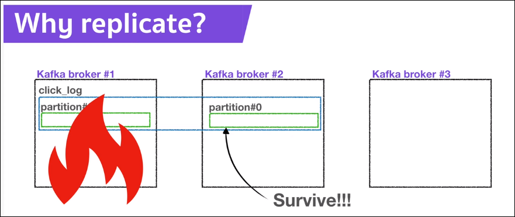

- 해당 기록은 유튜버 데브원영 님의 카프카 영상을 보며 기록하였습니다.
- https://www.youtube.com/channel/UCPdTFQUHzAzFobngtw1sFKg

# Broker, Replication, ISR

## Kafka Broker란?
- Kafka 가 설치되어 있는 서버단위
- 보통 3개 이상의 브로커로 구성
- 만약 3대의 브로커가 있고 1개의 파티션, 레플리케이션이 1인 토픽이 존재하면,    
브로커 3대중 1대에 해당 토픽의 정보(데이터)가 저장됨

  
---

## Replication?
- 파티션의 복제를 뜻함
- 만약 Replication 이 1 이라면, 파티션이 1개만 존재한다는 것
- 만약 Replication 이 2 라면, 원본 파티션 1개와 Replication 파티션 1개 총 2개가 존재한다는 뜻

  
- Replication이 3개 --> 원본 파티션 1 + 복제 파티션 2
- 단, 브로커의 개수에 따라 Replication 개수가 제한됨    
  --> 브로커개수가 3이면 Repl-은 4가 될수없음
---
- 원본 파티션 = Leader Partition
- 복제 파티션 = Follower Partition

  

---
## ISR (In Sync Replica)
- Leader + Follower Partition    
  --> ISR (In Sync Replica)

  
---
## Why replicate?
- Partition의 고가용성을 위해 사용
- 브로커가 사용 불능이 되어 Leader Partiton이 소실되면    
  --> Follower Partition이 리더 파티션의 역할을 승계

  
---
# Replication & ack
- 프로듀서가 토픽의 파티션에 데이터를 전달할때 데이터를 전달받는 주체가 Leader Partition
- ack를 통해 고가용성 유지
- ack 는 0, 1, all 3개의 옵션을 가짐(1개를 골라서 설정)
## When ack = 0
- 프로듀서는 리더 파티션에 데이터를 전송 하고 응답값은 받지 않음   
  --> Partition에 정상적으로 데이터가 복제되었는지 알 수 없음   
  --> 나머지 파티션에도 정상적으로 데이터가 복제되었는지 보장 안됨
- 속도는 빠르지만 데이터 유실의 가능성이 있음
  
  

---
## When ack = 1
- 프로듀서가 리더 파티션에 데이터 전송하고 응답값을 받음   
--> 다만, 나머지 Partition에 복제되었는지는 알지 못함
- 만약 리더 파티션이 데이터를 받자말자 브로커에 문제가 생기면    
--> 나머지 Partition에 데이터가 미처 전송되지 못한 상황   
--> ack 0 옵션과 같이 데이터 유실가능성 존재

  

---
## When ack = all
- 리더 파티션에 데이터 전송 후, 팔로워 파티션에도 데이터가 복제되면 프로듀서에 응답을 줌
- 데이터 유실 없음
- ***단! ack 0, 1에 비해 확인하는 부분이 많아 속도가 현저히 느리다는 단점***
  
  

---
## 적정한 Replication의 개수
- Replication이 무조건 많은게 좋은것이 아님
- Replication이 많아지면 Broker의 리소스 사용량도 많아짐   
--> 매우 느려짐!
- **따.라.서. Kafka에 들어오는 데이터량과 retention date, 즉 저장시간을 잘 생각해서 replication 개수를 정해야 함**
- 3개 이상의 Broker사용시 Replication은 3으로 설정하는것을 추천

  

- 서비스 운영중 생각보다 잦은 서버의 오류 발생
- 데이터유실을 막기위해 Broker, Replication, ISR 등 Kafka의 핵심 구성요소들이 중요한 역할을 함   
--> 데이터 파이프라인 구성때 Kafka의 역할이 점점 더 중요

---

