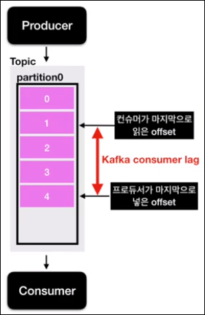
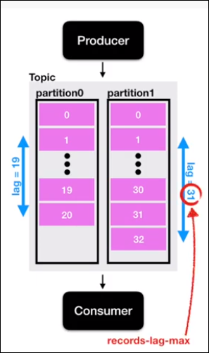

- 해당 기록은 유튜버 데브원영 님의 카프카 영상을 보며 기록하였습니다.
- https://www.youtube.com/channel/UCPdTFQUHzAzFobngtw1sFKg

---

# Kafka Consumer Lag

## Kafka Consumer Lag란?
- **프로듀서가 데이터를 넣는 속도와 컨슈머가 데이터를 가져가는 속도의 차이에서 발생하는 간격**    
  - 프로듀서가 마지막으로 넣은 offset vs 컨슈머가 마지막으로 가져간 offset   
  - lag은 적을 수도, 많을 수도 있음   
  - lag의 숫자를 통해 현재 해당 토픽에 대해 파이프라인으로 연계되어 있는    
     **프로듀서와 컨슈머의 상태에 대해 유추가 가능**
  - 주로 컨슈머의 상태에 대해 볼떄 사용
- 카프카를 운영함에 있어 매우 중요한 모니터링 지표중 하나
  
  
- 파티션이 1개인 토픽에 프로듀서가 데이터를 넣을 경우,
- 0부터 차례대로 숫자가 매겨짐
- 1 = 컨슈머가 마지막으로 읽은 offset
- 4 - 프로듀서가 마지막으로 넣은 offset
- Consumer lag = 4 와 1 사이의 간격 
---

## 파티션이 여러개인 경우
- 토픽에 여러 파티션이 존재할 경우,    
  -->**lag 또한 여러개가 존재할 수 있음**

  
- 파티션이 2개인 토픽에 컨슈머 그룹이 1개라면
- lag은 2개가 측정됨
- 한개의 토픽과, 컨슈머 그룹에 대한 lag이 여러개 존재할 때    
>가장 높은 숫자의 lag을 **records-lag-max**라고 함

- 컨슈머가 성능이 안나오거나 비 정상동작을 하게되면   
--> lag이 필연적으로 발생
--> 주의깊게 봐야함