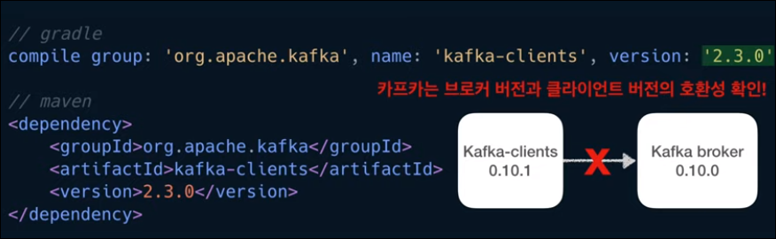

- 해당 기록은 유튜버 데브원영 님의 카프카 영상을 보며 기록하였습니다.
- https://www.youtube.com/channel/UCPdTFQUHzAzFobngtw1sFKg

---

# Kafka Consumer

## Kafka Consumer란?
- 카프카 브로커로부터 데이터를 가져오는데 사용
- 실질적인 데이터 프로세싱을 하기 위해 사용
- 토픽 내부의 파티션에 저장되어 있는 데이터를 가져옴   
  --> 폴링(polling) 이라고 함
  

---
## Consumer의 역할
- 토픽 내부의 파티션에서 메시지(data)를 가져오는 것   
  --> 특정 DB에 저장 / 또 다른 파이프라인에 전달
- 오프셋(offset) 위치를 기록(커밋)할 수 있음    
  --> offset: 파티션에 있는 데이터의 번호
- 컨슈머가 여러개일 경우 병렬 처리할 수 있음   
  --> 파티션 개수에 따라 컨슈머를 여러개 만들면 병렬처리가 가능하기 떄문에 더욱 빠른 속도로 데이터 처리 가능

---
## Consumer의 사용
- 프로듀서를 사용할떄 처럼 라이브러리 추가 필요 (기본적으로 자바 라이브러리 지원)
- Gradle / Maven 같은 라이브러리 관리 도구 사용하면 편리
- 카프카 브로커와의 버전 차이로 인해 문제 생길 수 있음    
  --> 버전 호환성 참고 (아파치 카프카 버젼별 하위호환 : https://blog.voidmainvoid.net/193)

---
## Consumer의 사용 (Java Property 설정)
- 자바 프로퍼티를 통해 기본적인 컨슈머 옵션 설정 가능
- bootstrap servers 옵션을 통해 카프카 브로커를 설정   
  --> 브로커의 문제가 생겼을때 다른 브로커가 붙을수 있도록 여러개의 브로커를 설정하기
- Group id 지정(컨슈머 그룹)
- Key와 value에 대한 직렬화 설정 추가

- 컨슈머 생성을 위한 기본 설정들

---

## Consumer 인스턴스 생성
- Consumer 인스턴스를 통해 데이터를 읽고 처리 가능  
  

---

- 어느 토픽을 대상으로 데이터를 가져올지 선언
- Consumer의 subscirbe() 메서드를 통해 설정

- 만약, 특정 토픽의 전체 파티션이 아니라 일부 파티션의 데이터만 가져오고 싶다면    
--> assign() 메서드 사용   
--> key가 존재한다면 아래 그림과 같이 데이터의 순서를 보장하는 데이터 처리 가능

---
## 폴링 루프 (polling loop)
- 실질적으로 데이터를 가져오는 구문
- poll() 메서드가 포함된 무한루프   
- 컨슈머 API의 핵심 로직:   
--> 브로커로부터 연속적으로, 컨슈머가 허락하는 한 많은 데이터를 읽어오는 것

- poll() 메서드에서 설정한 시간동안 데이터를 기다림 (위 사진에선 500ms)
- 0.5초 동안 데이터가 도착하기를 기다리고 이후 코드 실행
- 0.5초 동안 데이터가 들어오지 않으면, 빈값의 records 변수를 반환
- 데이터가 있다면 데이터가 존재하는 records 값을 반환
- records 변수는 데이터 배치로서 레코드의 묶음 list 임   
--> 카프카에서 데이터 처리할때, 가장작은 단위인 records로 나누어 처리

- for 구문 내부에서 record 변수의 value() 메서드로 반환된 값이 이전에 producer가 전송한 데이터
- 위의 사진에선 단순히 특정 토픽에서 가져온 데이터를 println으로 찍어보기만 함
- 실제 기업에선 하둡 또는 엘라스틱서치와 같은 저장소에 저장하는 로직을 넣기도 함
  
---

## Producer.send()
- 키가 null인 경우 각 파티션에 데이터가 round-robin 방식으로 들어감
  

---

## Offset number
- 파티션에 들어간 데이터는, 파티션 내에서 고유한 번호를 가짐 --> offset number
- 토픽별로, 파티션별로 별개로 지정됨
- 컨슈머가 데이터를 어느 지점까지 읽었는지 확인하는 용도로 사용됨
  

---
## Consumer.poll()
- 컨슈머가 데이터를 읽기 시작하면, offset을 commit하게 되는데, 이렇게 가져간 정보에 대한 내용은    
--> 카프카의 __consumer_offset 토픽에 offset 정보를 저장함

- consumer는 파티션이 2개인 click_log 토픽에서 데이터를 가져감
- 데이터를 가져갈 떄마다 offset 정보가 저장됨

---
- 그런데 만약 컨슈머가 중간에 문제가 생겨 멈춘다면 (파티션 0의 3번 오프셋, 파티션 1의 2번 오프셋 까지 읽고 멈춤)   
--> 해당 컨슈머가 어디까지 읽었는지에 대한 정보는 __consumer_offset에 저장되어 있음

- 해당 컨슈머를 재실행하면, 중지된 시점을 알고 있으므로, 해당 지점부터 다시 데이터를 읽기 시작함 
- 컨슈머에 이슈가 발생하더라도, 데이터의 처리 시점을 복구할 수 있음   
--> 고가용성의 특징을 가짐

---
## Multiple Consumer
- 컨슈머가 하나일때는 2개의 파티션에서 데이터를 가져감

- 컨슈머가 2개일때는 각 컨슈머가 각각의 파티션을 할당하여 데이터를 가져가서 처리

- 컨슈머가 3개일때는, 이미 파티션들이 각 컨슈머에 할당되었기 때문에   
--> 더이상할당될 파티션이 없어 동작하지 않음   
--> Consumer의 개수는 partition 개수보다 적거나 같아야 함
