- 해당 기록은 유튜버 데브원영 님의 카프카 영상을 보며 기록하였습니다.
- https://www.youtube.com/channel/UCPdTFQUHzAzFobngtw1sFKg

# Producer

## Producer란?
- 데이터를 카프카에 보내는 역할
- ex) 100만개의 클릭로그들을 대량/실시간으로 카프카에 적재할때 사용

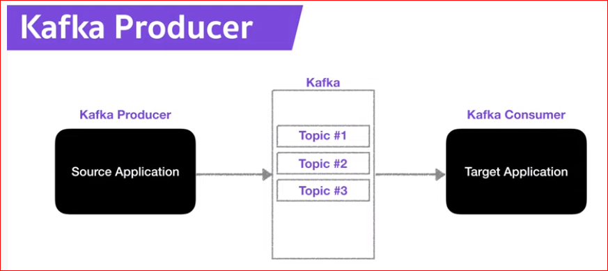
 
- 데이터를 카프카 topic에 생성/적재

---

## Producer의 Role
- Topic에 전송할 메시지를 생성
- 특정 topic으로 데이터를 publish(전송)을 할 수 있음
- 카프카 브로커로 전송할때 전송 성공여부를 알 수 있음   -> 실패시 재시도 가능

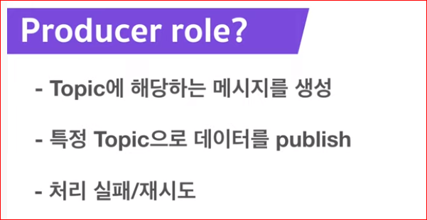

---

## 카프카 라이브러리
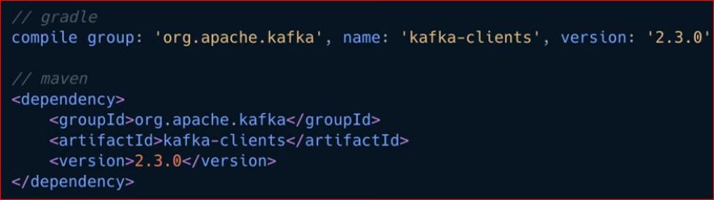
 
 - 카프카 클라이언트인 Consumer 와 Producer를 사용하기 위해선 카프카 라이브러리를 설치해줘야함
 - 라이브러리는 gradle 이나 maven을 사용하여 편리하게 설치가능
 ---

## 카프카 클라이언트를 디펜던시로 잡을때 주의사항
 - Version !!
 - 브로커 버전과 클라이언트 버전의 하위호환성이 모든 버전에대해 지원하지 않음
 - 클라이언트 버전별 하위호환성에 대해 반드시 숙지해야함
 - 아파치 카프카 버젼별 하위호환 : https://blog.voidmainvoid.net/193 (참고)
 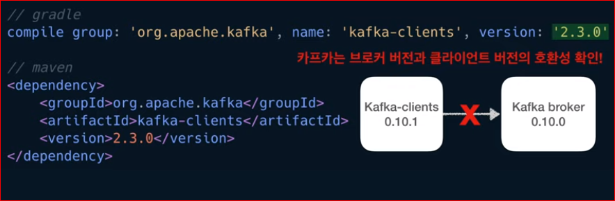
---

## 카프카 프로듀서 코드
## 객체 생성
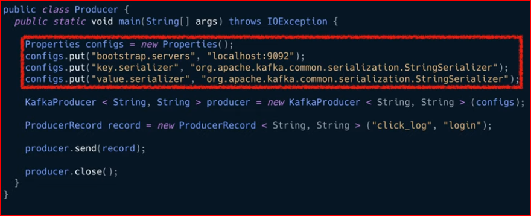
 
## 프로듀서 설정
- 부트스트랩의 서버 설정을 로컬호스트의 카프카를 바라보도록 설정해논것
- * 카프카 브로커의 서버 설정은 되도록이면 2개 이상의 ip와 port를 설정하도록 권장   둘중 한개 브로커가 비정상일때 다른 정상의 브로커에 연결되어 사용하기 위해
- 나머지 key 와 value에 대해 스트링시리얼라이저로 직렬화 설정해놈
    - serialize: key/value 를 직렬화하기 위해 사용 Byte array, String, Integer 시리얼라이즈를 사용
    - Key: 메시지(데이터)를 보내면, 토픽의 파티션이 지정될 떄 사용됨
---

## 프로듀서 인스턴스 생성
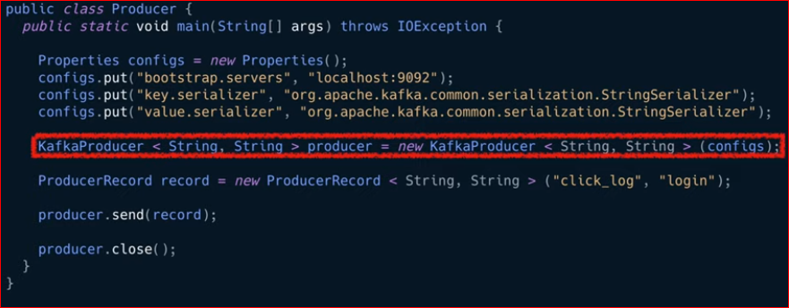
---

---

## ProducerRecord 클래스
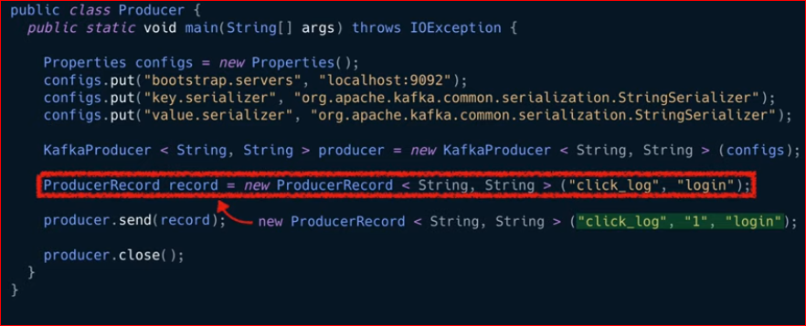
 
- 카프카 클라이언트에서는 ProducerRecord 클래스를 제공
- ProducerRecord 인스턴스를 생성할떄 어느 토픽에 어떤 value와 key에 넣을 것인지 지정가능
    - 위 코드는 click_log 토픽에 login 이라는 value를 넣는것
    - 아래 코드는 click_log 토픽의 1 파티션에 login value를 넣는것
- 파라미터 개수에 따라 자동으로 오버로딩되어 인스턴스가 생성됨(?) 
  -> 이점을 유의하여 ProducerRecord를 생성해야함
 
 - 밑에있는 send()를 통해 이전에 생성된 프로듀서 인스턴스에 ProducerRecord를 넣으면 전송됨
 - 전송이 완료되면 close() 메서드를 통해 종료

---

## Producer.send()

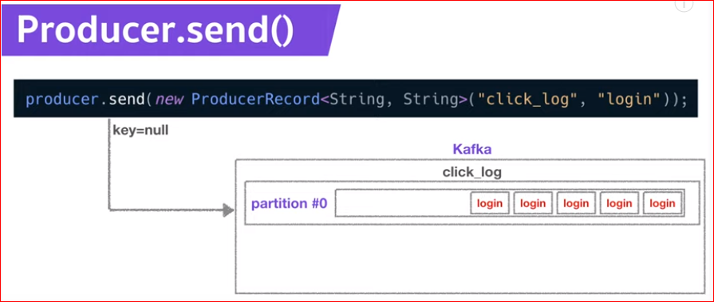
 

- key가 null인 데이터를 파티션이 1개인 토픽에 보내면 데이터가 순차적으로 쌓임

---

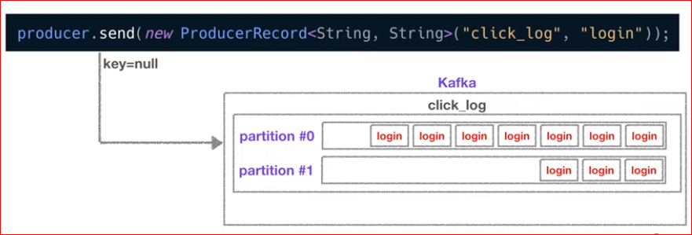
 
- 파티션이 2개이고 key가 null인 경우 round-robin으로 두개의 파티션에 차곡차곡 쌓임

---

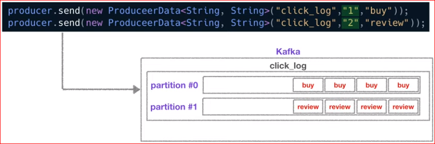
 
- 파티션이 2개이고 key가 1, 2로 각각 정해져있을때  (키를 특정한 hash값으로 변형시켜 파티션과 1:1 매칭시킴)
    - buy는 1(partition #0)에, review는 2(partition #1)에 쌓임 (각 파티션에 동일 key의 value만 쌓임)

---

## 토픽에 새로운 파티션이 추가될때!
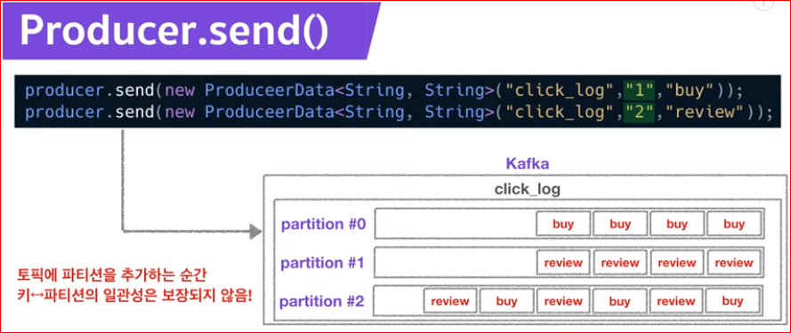
 
- 새로운 파티션이 추가되면 Key와 파티션의 매칭이 깨짐
    - Key와 파티션의 연결은 보장되지 않음  
    --> Key를 사용할 경우 이점을 유의하여 파티션 개수를 생성  
    --> 추후에 추가적으로 파티션 생성하지 않는것을 추천한다함

---
